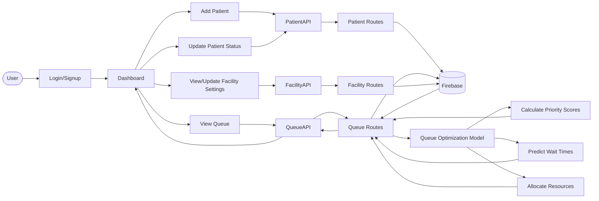
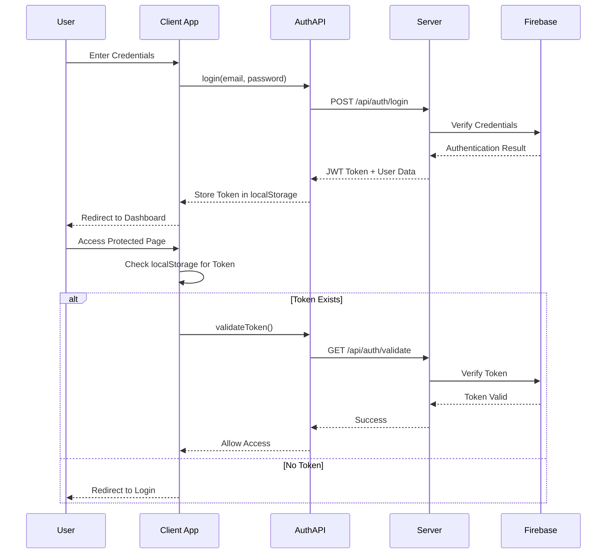
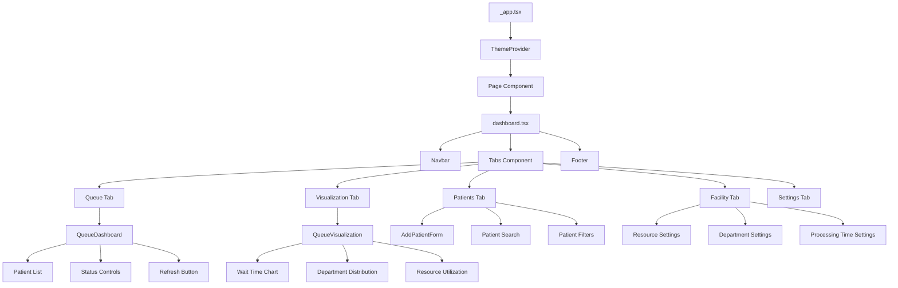
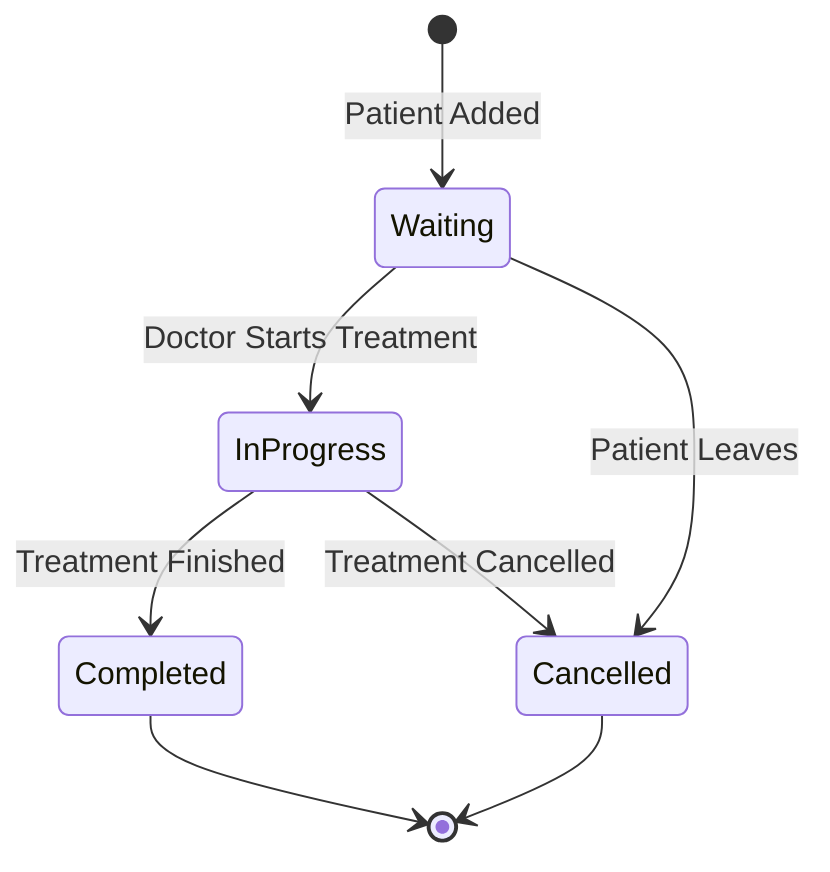
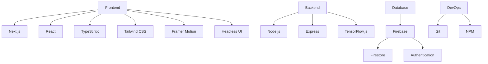

# flowAID Healthcare System Architecture Flowchart

## Application Overview

flowAID is a healthcare queue optimization system that uses AI/ML to prioritize patients and predict wait times. The application is built with Next.js and uses Firebase for data storage.

```mermaid
flowchart TD
    %% Main Application Flow
    Client[Client Browser] --> NextJS[Next.js Application]
    NextJS --> Pages[Pages]
    NextJS --> Components[Components]
    NextJS --> API[API Services]
    API --> Server[Backend Server]
    Server --> Firebase[(Firebase Database)]
    Server --> ML[ML Models]
    
    %% Pages Structure
    Pages --> IndexPage[index.tsx\nRedirect to Login/Dashboard]
    Pages --> LoginPage[login.tsx\nUser Authentication]
    Pages --> SignupPage[signup.tsx\nUser Registration]
    Pages --> DashboardPage[dashboard.tsx\nMain Application Dashboard]
    Pages --> DoctorDashboard[dashboard/doctor.tsx\nDoctor-specific View]
    Pages --> PatientDashboard[dashboard/patient.tsx\nPatient-specific View]
    Pages --> DoctorProfile[profile/doctor.tsx\nDoctor Profile Management]
    Pages --> PatientProfile[profile/patient.tsx\nPatient Profile Management]
    
    %% Components Structure
    Components --> UIComponents[UI Components]
    Components --> FunctionalComponents[Functional Components]
    
    UIComponents --> Navbar[Navbar.tsx]
    UIComponents --> Footer[Footer.tsx]
    UIComponents --> Button[Button.tsx]
    UIComponents --> DarkModeToggle[DarkModeToggle.tsx]
    UIComponents --> Logo[Logo.tsx]
    
    FunctionalComponents --> QueueDashboard[QueueDashboard.tsx\nQueue Management Interface]
    FunctionalComponents --> QueueVisualization[QueueVisualization.tsx\nVisual Queue Representation]
    FunctionalComponents --> AddPatientForm[AddPatientForm.tsx\nPatient Registration Form]
    
    %% Services
    API --> AuthAPI[AuthAPI\nAuthentication Services]
    API --> PatientAPI[PatientAPI\nPatient Management]
    API --> QueueAPI[QueueAPI\nQueue Operations]
    API --> FacilityAPI[FacilityAPI\nFacility Management]
    API --> ModelAPI[ModelAPI\nML Model Interactions]
    
    %% Server Structure
    Server --> ServerRoutes[Server Routes]
    Server --> ServerModels[Server Models]
    
    ServerRoutes --> AuthRoutes[auth.js\nAuthentication Endpoints]
    ServerRoutes --> PatientRoutes[patients.js\nPatient Endpoints]
    ServerRoutes --> QueueRoutes[queue.js\nQueue Management Endpoints]
    ServerRoutes --> FacilityRoutes[facility.js\nFacility Management]
    ServerRoutes --> ModelRoutes[model.js\nML Model Endpoints]
    
    ServerModels --> QueueOptimizationModelJS[QueueOptimizationModel.js\nServer-side ML Model]
    ServerModels --> TrainingDataGeneratorJS[TrainingDataGenerator.js\nTraining Data Generation]
    
    %% Client Models
    ML --> QueueOptimizationModelTS[QueueOptimizationModel.ts\nClient-side ML Model]
    ML --> TrainingDataGeneratorTS[TrainingDataGenerator.ts\nClient-side Data Generation]
    
    %% Services
    QueueService[QueueService.ts\nQueue Management Logic] --> QueueOptimizationModelTS
    QueueService --> Firebase
```



## Data Flow Diagram



## Authentication Flow



## Queue Optimization Process

```mermaid
flowchart TD
    %% Queue Optimization Process
    Start([Queue Update Triggered]) --> FetchPatients[Fetch Waiting Patients]
    FetchPatients --> FetchFacility[Fetch Facility State]
    FetchFacility --> ExtractFeatures[Extract Patient Features]
    ExtractFeatures --> CalculatePriority[Calculate Priority Scores]
    CalculatePriority --> PredictWaitTimes[Predict Wait Times]
    PredictWaitTimes --> AllocateResources[Allocate Resources]
    AllocateResources --> UpdateQueue[Update Queue in Database]
    UpdateQueue --> NotifyClients[Notify Connected Clients]
    NotifyClients --> End([End Process])
    
    %% Feature Extraction Detail
    ExtractFeatures --> UrgencyLevel[Urgency Level (1-5)]
    ExtractFeatures --> AppointmentType[Appointment Type]
    ExtractFeatures --> AgeGroup[Age Group]
    ExtractFeatures --> SpecialNeeds[Special Needs]
    ExtractFeatures --> WaitTime[Current Wait Time]
    ExtractFeatures --> ProcedureTime[Estimated Procedure Time]
    
    %% Facility State Factors
    FetchFacility --> ResourceAvailability[Resource Availability]
    FetchFacility --> DepartmentLoads[Department Loads]
    FetchFacility --> PeakHours[Peak Hours Status]
    FetchFacility --> PatientCount[Current Patient Count]
    
    %% ML Model Integration
    CalculatePriority --> MLModel[ML Model]
    PredictWaitTimes --> MLModel
    MLModel --> TrainedWeights[Trained Weights]
```

## Component Hierarchy



## Patient Status Flow



## Technology Stack



This flowchart provides a comprehensive overview of the flowAID healthcare queue optimization system, showing the relationships between different components, data flow, and the overall architecture of the application.